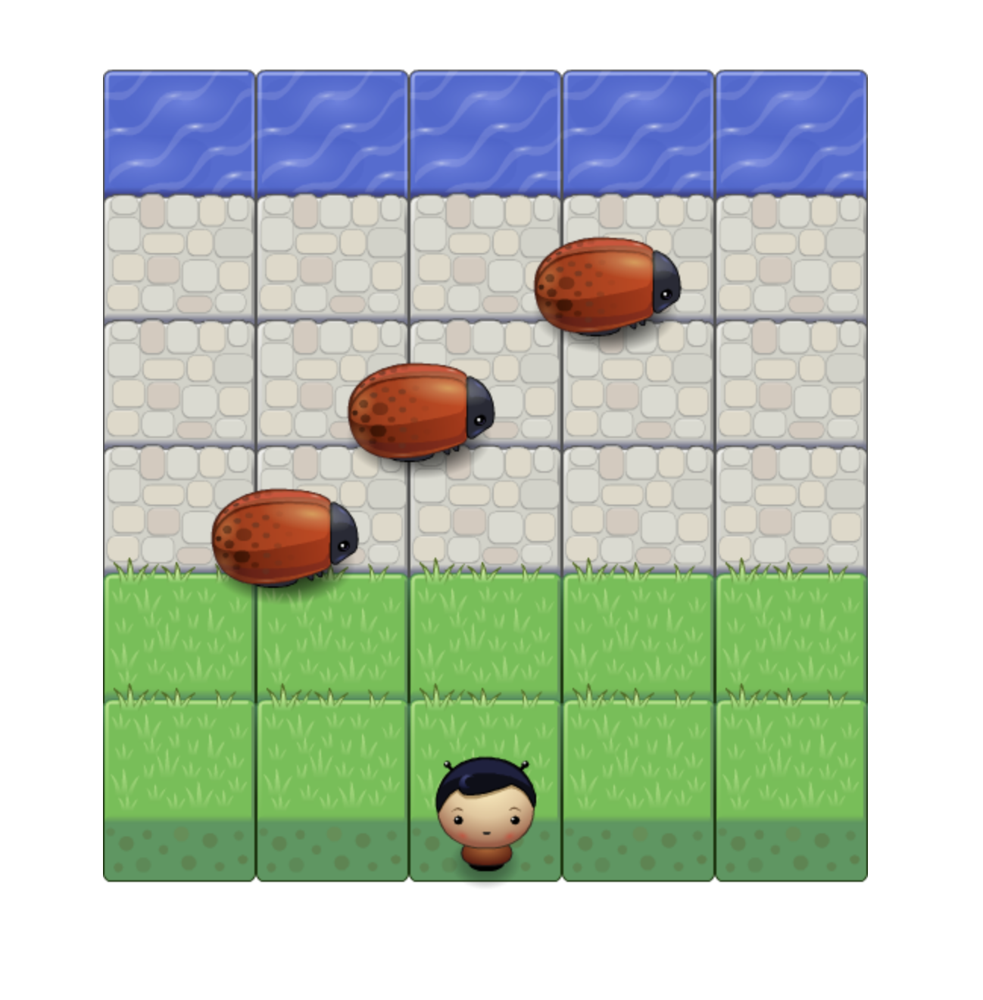

# Frontend Nanodegree Arcade Game

An arcade game that relies on JavaScript. The goal is to get your player safely to the top of the screen and avoid collisions with enemies (bugs).

## Table of Contents

* [Instructions](#instructions)
* [Tools](#tools)
* [Inside the game](#inside)

## Instructions

* Load this link in your browser https://ivailionyte.github.io/frontend-nanodegree-arcade-game/
* Start moving a player to the top of the screen by using up, down, left, right arrow keys.
* Try to avoid collision with the moving enemies.
* Game ends when a player collides with an enemy. 
* After lost the game resets with the player at the bottom of the screen.

## Tools

* Object-Oriented JavaScript
* Class functions
* Class prototype functions

## Inside the game

